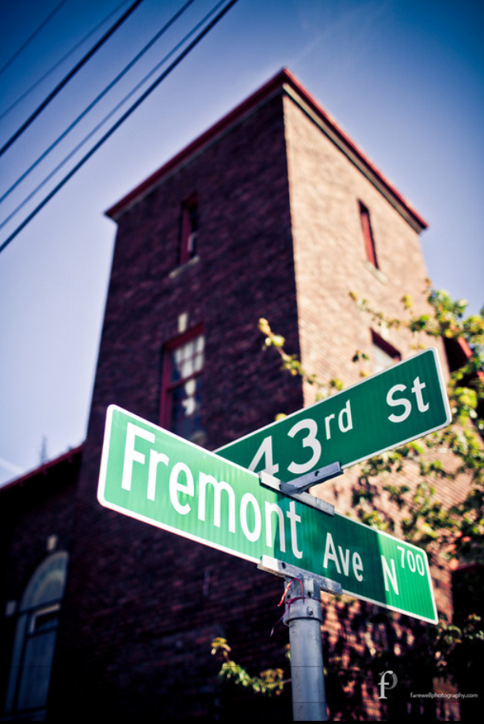
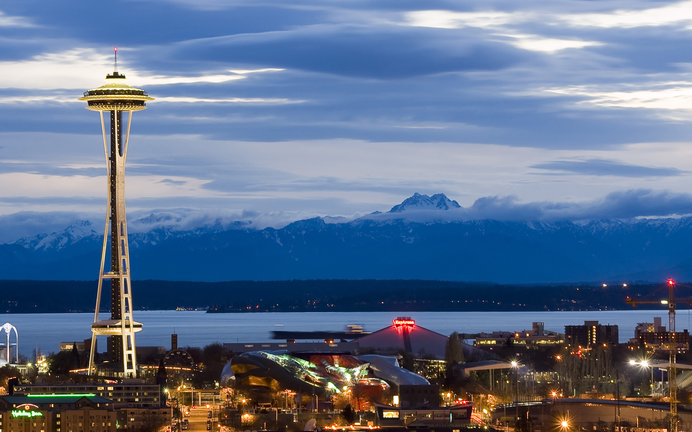

# The wedding of Kristina Mulvihill and James Proulx 

## Basic information

*Note, this website is still under construction*

### Date and Time

The wedding will be **March 20th, 2027**
Exact time TBD

### Location

[Fremont Abbey Arts Center](https://maps.app.goo.gl/CXq6KW6TQJCfWsEdA)
4272 Fremont Ave N, Seattle, WA 98103

### Important notes

- RSVP/Formal invites coming soon!
- This wedding will be strictly **child-free**
- I recommend trying to find somewhere to stay north of Seattle, not in the downtown area to save on cost. Hotels can be expensive. Keep an eye on prices and book early!
- Food and alcohol will be provided

### Gifts

We are *not doing a registry or gifts.* If you absolutely must, consider donating to one of these charities on our behalf:
- [Mary's place charity for homeless families](https://www.marysplaceseattle.org/)

## Seattle

### Public transit

Seattle has an [expansive light rail system](https://www.soundtransit.org/ride-with-us/stations/link-light-rail-stations), which could enable you to take a bus/uber from the nearest light rail stop to the venue
- The northernmost light rail stop (and therefore the area with the cheapest accomodations) is [Lynwood City Center](https://maps.app.goo.gl/voEkHjbgeUsDMSWV8)
- [Public transit from the nearest light rail stop to the venue](https://maps.app.goo.gl/jpMVnL2ef9pfePPY7)
- The light rail **stops running around midnight, be aware of this when planning your trip home**
- *You could save a lot of money by staying further up in somewhere like Lynwood and taking the transit as opposed to staying right near the venue!*
- Refer to the [Sound transit website](https://www.soundtransit.org/) for up to date information.

### Car travel

Public transit is by far the cheapest way to get around Seattle. If you can't or won't take public transit, consider uber/lyft or renting a car.

- Seattle has the [*most expensive uber rides in the country.*](https://www.kiro7.com/news/local/seattle-has-most-expensive-uber-rides-us-study-finds/JTNS5URATBFSLAH4K7ADS4MNBQ/). Consider the price of renting a car if you intend on making multiple journeys/seeing the sights in Seattle.

### Things to do

Seattle is one of the most beautiful and unique cities in the country. You will have no shortage of interesting things to do and see if you have some spare time in the city. Consider:

#### Pike Place Market

